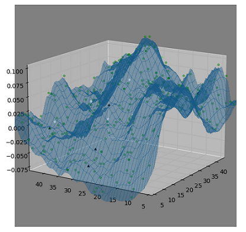

# PatchEcoSim
Ecological simulation in 3D of a piece of terrain

### References

I have followed tutorials and fetched code from:

* Jack McKew's Blog 
  (https://jackmckew.dev/3d-terrain-in-python.html)
* How to Build Software
  https://www.howtobuildsoftware.com/index.php/how-do/VXR/matlab-matplotlib-plot-surface-display-the-maximum-surface-in-matplotlib
* Matplotlib documentation
  https://matplotlib.org/stable/gallery/mplot3d/scatter3d.html
