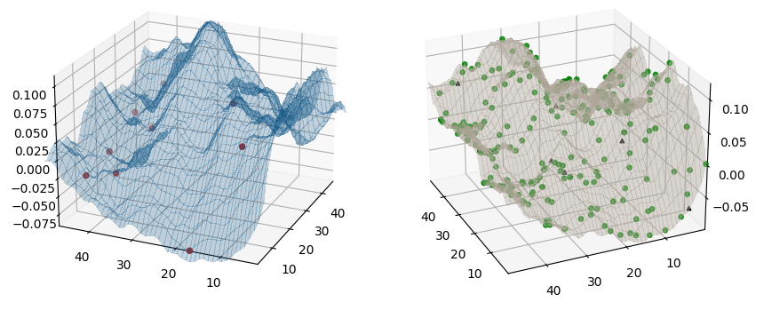

# MiniNet EcoSim
### Ecological simulation in 3D of a piece of terrain
The aim of this project is to make an animated simulation of a small
ecological network happening in a place. There are lot of scientific
methods for achieveng great mimicking of the real world so, instead, 
this project focuses on making the simulation visually attractive 
while taking some of the ideas and information from those projects.

### Gallery

### References

I have followed tutorials and fetched code from:

* Jack McKew's Blog 
  (https://jackmckew.dev/3d-terrain-in-python.html)
* How to Build Software
  https://www.howtobuildsoftware.com/index.php/how-do/VXR/matlab-matplotlib-plot-surface-display-the-maximum-surface-in-matplotlib
* Matplotlib documentation
  https://matplotlib.org/stable/gallery/mplot3d/scatter3d.html
